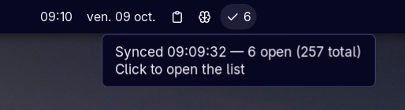
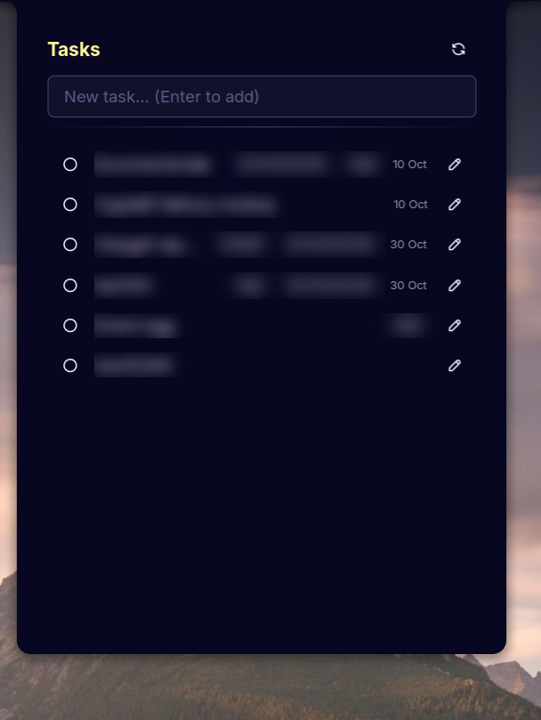
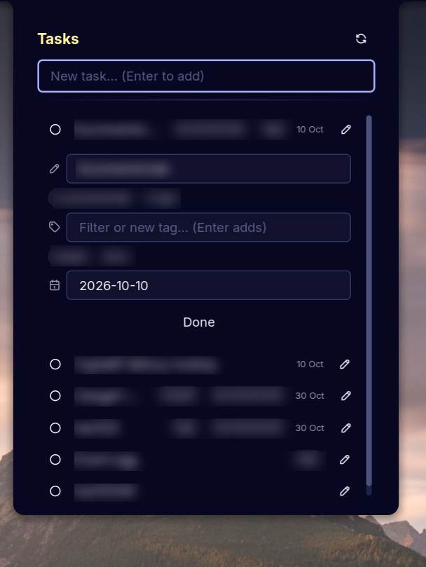

# CalDAV Tasks Sync — a Noctalia plugin

A to-do panel and bar widget for [Noctalia](https://noctalia.dev) v5 that syncs with a
CalDAV task calendar. Tested with **Nextcloud Tasks**.



## Features

- Add tasks (type, press Enter) and complete them with the circle.
- Completed tasks stay at the end of the list for 30 seconds, dimmed, with an undo button.
- Edit the title, tags and due date of a task in an inline editor (pencil icon).
- Tags are stored as iCalendar `CATEGORIES`. The editor suggests tags already used in the calendar.
- Due dates are date-only (`YYYY-MM-DD`). Overdue dates are highlighted.
- The bar widget shows the number of open tasks, with a `!` after it when the last sync failed.
  The tooltip shows the sync status.
- Tasks are cached on disk and shown at startup, and while the server is unreachable.

| Task list | Inline editor |
|---|---|
|  |  |

## Requirements

- Noctalia v5 (plugin API 26)
- `python3`

## Install

```
noctalia msg plugins source add caldav-tasks git https://github.com/tomassplatch/noctalia-caldav-tasks.git
```

Then enable **CalDAV Tasks Sync** and fill in the plugin settings.

## Settings

| Setting | |
|---|---|
| Server URL | e.g. `https://cloud.example.com` |
| Username | |
| App password | Nextcloud: Settings → Security → *Devices & sessions* |
| Calendar name | the task list's name (default `personal`); matching is forgiving: case, spaces, partial |
| Calendar URL | optional; if set, discovery is skipped and this exact calendar is used |
| Sync interval | seconds between checks, 30–600 (default 120) |

## Calendar discovery

1. the *Calendar URL* setting, if filled in;
2. Nextcloud's layout (`/remote.php/dav/calendars/<user>/`);
3. standard CalDAV discovery (`current-user-principal` → `calendar-home-set`), keeping only
   calendars that support tasks (`VTODO`).

Other CalDAV servers (Radicale, Baïkal, Synology, …) should work through 2–3 or via the
*Calendar URL* setting, but only Nextcloud has been tested by the author.
Google Calendar needs OAuth and is **not** supported.

## Synchronisation

- The panel refreshes when it is opened, when you press the refresh button, and after every edit.
- Between those, the plugin checks the calendar's change marker (CTag or sync-token) at the
  configured interval and downloads the tasks only if it changed.
- After failed syncs (offline, server down, wrong credentials) the checks are spaced out, up
  to 30 minutes. A manual refresh or a settings change resets this.
- No automatic sync happens while Noctalia's offline mode is on.
- Completed and cancelled tasks are not listed. The panel shows at most 200 open tasks.

## Safety

- Edits are `GET` → change one property → `PUT`. The `PUT` is conditional (`If-Match`) on the
  ETag from the last sync, so a change made in another app since then is refused rather than
  overwritten. After the plugin's own write, the ETag is not known until the next sync, so a
  second edit to the same task in that window is not conditional.
- Credentials are only sent to the configured server, and never over a downgrade from https
  to http. Task URLs returned by the server that point to another host are ignored.
- New tasks are created with `If-None-Match: *`, so an existing item is never replaced.

## Troubleshooting

Hover over the bar widget to see the last sync message, for example a missing setting, a
wrong password (HTTP 401), or a calendar name that was not found together with the names
that are available. If the sync script crashes, the error is also written to `error.log` in
the plugin's data directory.

## Known limitations

- The app password is passed to a helper process as an argument, so other local users can see
  it in the process list while a sync runs. Use an app password, not your main password.
- Due dates are date-only; time of day is not editable.
- Recurring tasks are shown but not specially handled.
- Tasks are shown as a flat list. Subtasks, priority and notes are neither shown nor edited,
  and tasks cannot be deleted from the panel.
- The code was written largely with AI assistance and has been tested only by the author,
  on Nextcloud. Read it before trusting it with data you cannot afford to lose.
